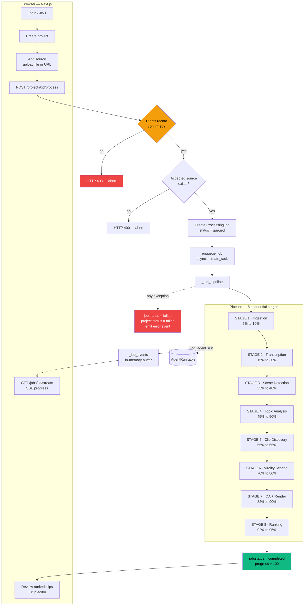
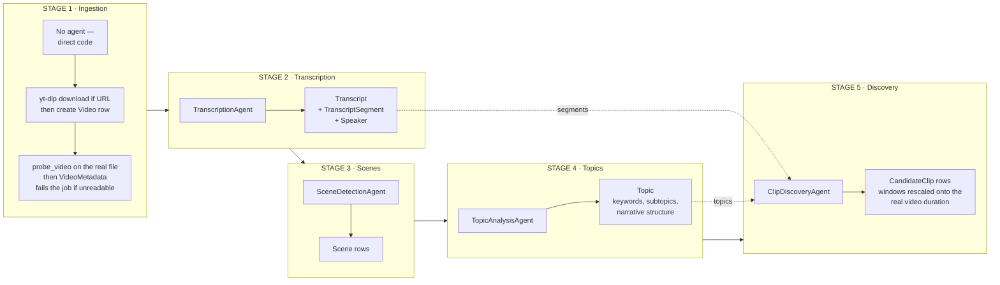
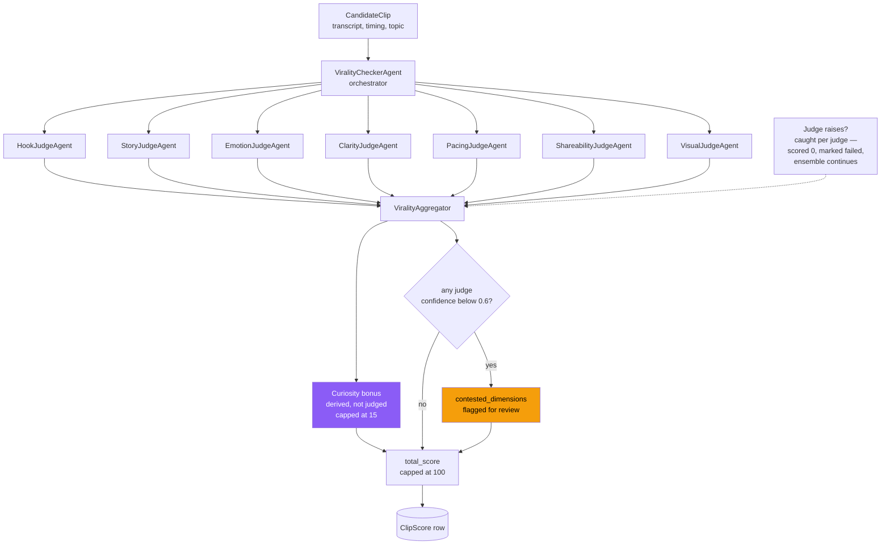
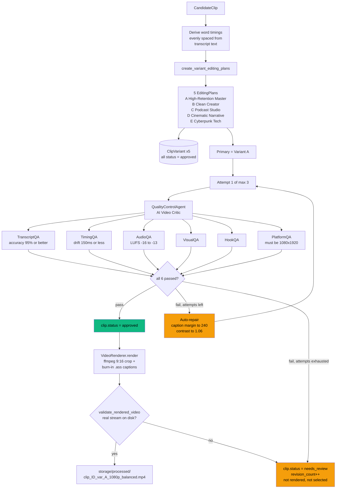

# ClipForge AI — Pipeline Workflow

Agent-by-agent map of how a video becomes ranked vertical clips.

Everything below is derived from the code, not the README. Section 7 records the defects
found during this audit and how each was resolved — the diagrams describe the code as it
stands **after** those fixes.

**Source of truth:** `apps/api/workers/job_runner.py` (`_run_pipeline`) is the orchestrator. It runs as a single in-process `asyncio` background task — there is no queue broker.

---

## 1. End-to-end flow

---

## 2. Stage detail — which agent runs where

Stages 2–5 each run exactly one agent. Stages 6 and 7 are **ensembles** — see below.

---

## 3. Stage 6 — the virality ensemble (7 judges)

Runs **once per candidate clip**, in a loop.

### Weighted consensus

| Dimension | Weight | Produced by |
| --- | --- | --- |
| Hook | 20 | `HookJudgeAgent` |
| Curiosity | 15 | **Aggregator** — derived from hook/story/emotion signals |
| Story | 15 | `StoryJudgeAgent` |
| Emotion | 10 | `EmotionJudgeAgent` |
| Pacing | 10 | `PacingJudgeAgent` |
| Clarity | 10 | `ClarityJudgeAgent` |
| Visual | 10 | `VisualJudgeAgent` |
| Shareability | 10 | `ShareabilityJudgeAgent` |
| **Total** | **100** |  |

**7 judges, 8 scored dimensions.** Curiosity has no judge — the aggregator synthesises it from cross-agent signals: +5 contrast hook, +4 strong hook, +3 story arc, +3 emotional variety.

---

## 4. Stage 7 — variants, AI critic, and the repair loop

Runs **once per candidate clip**.

Only **Variant A is rendered to video**. B–E are persisted as database rows describing an intended edit; no file is produced for them.

---

## 5. Stage 8 — ranking

---

## 6. Agent inventory

Every agent inherits `BaseAgent` (`agents/base.py`) and is invoked through `.run()`, which wraps `.execute()` with up to **3 retries** and returns a uniform `AgentResult` (confidence, reasoning, duration, retry count, provider). Each `.run()` in the pipeline is persisted to the `AgentRun` table, which is what powers the per-agent UI timeline.

| Agent | Stage | Wired in? |
| --- | --- | --- |
| `TranscriptionAgent` | 2 | yes |
| `SceneDetectionAgent` | 3 | yes |
| `TopicAnalysisAgent` | 4 | yes |
| `ClipDiscoveryAgent` | 5 | yes |
| `ViralityCheckerAgent` + 7 judges | 6 | yes |
| `QualityControlAgent` + 6 QA sub-agents | 7 | yes |
| `MetadataAgent` | — | On demand only, via `GET /clips/:id/metadata` — titles, description, hashtags. Not part of the pipeline. |

`HookAgent`, `RetentionAgent`, and `VariantAgent` previously sat in `agents/` with zero
references. They have been deleted.

---

## 7. Defects found, and how they were resolved

These were all present in the original implementation and have since been fixed. They are
kept here because the shared failure mode is worth remembering: **every one of them
converted a failure into a plausible-looking success**, which is why a green test suite did
not surface any of them.

| # | Defect | Resolution |
| --- | --- | --- |
| 1 | `probe_video` fabricated metadata — a hardcoded `duration=30.0` with dimensions guessed from one substring check — whenever `ffprobe` was unavailable. On a 10s 1280x720 file it reported 30.0s 1920x1080. | `get_ffprobe_binary()` resolves `FFPROBE_PATH`, an imageio sibling, or `PATH`, returning `None` if genuinely absent. The fallback now parses real values out of `ffmpeg -i` stderr and returns `is_valid=False` rather than guessing dimensions. |
| 2 | The QA repair loop could not reject. Exhausted retries set `status = "approved"` and incremented `passed_count`; `revision_count` never incremented, so the summary always said "0 need review". | Exhausted repairs now set `needs_review`, increment `revision_count`, and emit the failing check names. |
| 3 | The 7 judges ran sequentially despite a comment claiming parallelism — each coroutine was awaited inside a `for` loop. | Replaced with `asyncio.gather(..., return_exceptions=True)`, preserving per-judge failure isolation. Test suite time halved. |
| 4 | Stage 1 wrote hardcoded metadata (228.0s, 1920x1080, 30fps, h264) for every video, never calling the working `probe.py`. | Stage 1 now probes the real file and derives the aspect ratio; an unreadable source fails the job instead of proceeding on invented numbers. |
| 5 | The rights gate never blocked — a missing `RightsRecord` was auto-created as "Auto-confirmed rights by project owner". | `process_project` now returns **403**. The UI already confirms rights before processing, so the normal flow is unaffected. |
| 6 | If the recorded source path was missing or a stale `.part`, Stage 7 globbed `storage/uploads/*.mp4` and rendered the first file over 1 MB — potentially a different video entirely. | The glob fallback is removed; an unavailable source raises. |
| 7 | The README and `docs/agents.md` claimed 7 QA agents; the code registers 6. | Both corrected to 6. |
| 8 | `ClipDiscoveryAgent`'s candidate windows were hardcoded against a ~228s reference video. On any shorter source every clip started past EOF, so ffmpeg exited 0 while writing a 261-byte streamless MP4 — and the job still reported success. | Candidates are rescaled proportionally onto the real duration, and clips collapsing below 1s are dropped. |
| 9 | Nothing verified render output. `validate_rendered_video()` existed but was never called by the pipeline. | Every render is validated; a clip whose file has no usable stream becomes `needs_review` rather than `approved`. |
| 10 | `is_selected` was computed by ranking but absent from every response schema, so the UI could not identify the top 5. | Added to `CandidateClipResponse` and populated in `_clip_to_response`. |
| Agent | Stage | Wired in? |
| --- | --- | --- |
| `TranscriptionAgent` | 2 | yes |
| `SceneDetectionAgent` | 3 | yes |
| `TopicAnalysisAgent` | 4 | yes |
| `ClipDiscoveryAgent` | 5 | yes |
| `ViralityCheckerAgent` + 7 judges | 6 | yes |
| `QualityControlAgent` + 6 QA sub-agents | 7 | yes |
| `MetadataAgent` | — | On demand only, via `GET /clips/:id/metadata` — titles, description, hashtags. Not part of the pipeline. |
| `HookAgent` | — | **Dead code** — zero references |
| `RetentionAgent` | — | **Dead code** — zero references |
| `VariantAgent` | — | **Dead code** — superseded by `create_variant_editing_plans` |

Defects 8–10 were found only by driving the real API end to end — the unit suite was
green throughout. `scripts/e2e_smoke.py` now covers that path and
asserts on actual artifacts (probe-verified 1080x1920 output) rather than HTTP status codes.

Ranking was also tightened as a consequence of #2: `is_selected` is now granted only to
clips with `status = "approved"`, so a `needs_review` clip can no longer occupy a top-5 slot.

### Still worth knowing

- **`ffprobe` is not installed on this machine.** Metadata therefore comes from the ffmpeg
  stderr parser, which is accurate but reads fewer fields than ffprobe's JSON (no per-stream
  bitrate, no exact channel count beyond mono/stereo). `GET /api/health` reports which path
  is live via `metadata_source`. Installing ffprobe or setting `FFPROBE_PATH` restores the
  richer path with no code change.
- Clips in `storage/processed/` rendered before these fixes were produced under the
  fabricated-metadata code and should not be used to judge current output quality.
