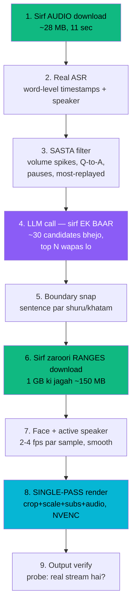

---
planStatus:
  planId: plan-clipforge-real-pipeline
  title: ClipForge — Demo Mode se Real Auto-Clipper
  status: in-review
  planType: initiative
  priority: high
  owner: pookyrohan
  stakeholders: []
  tags: [auto-clipper, pipeline, asr, llm, video, performance]
  created: "2026-09-12"
  updated: "2026-09-12T09:15:00.000Z"
  progress: 95
---

# ClipForge — Demo Mode se Real Auto-Clipper

## Goal

Abhi ClipForge ka **skeleton real hai, intelligence fake hai**. Rendering, captions aur
storage sach me kaam karte hain; clip selection hardcoded hai, 7 virality judges `random`
use karte hain, aur "speaker tracking" kisi face ko track nahi karta.

Is plan ka maqsad: pipeline ko aisa banana ki **koi bhi video daalo to sach me achhe clips
nikle** — aur tez nikle.

### Core principle

> **Sasta kaam sab par karo. Mehnga kaam sirf 2% par karo.**

Zyada auto-clippers isliye slow hain kyunki wo pehle 1 GB download karte hain aur har frame
decode karte hain — ye jaane bina ki unhe sirf 2% video chahiye.

---

## Current state (verified)

| Cheez | Abhi | File |
|---|---|---|
| Clip selection | 7 hardcoded time windows, har video ke liye same | `agents/clip_discovery_agent.py` |
| Virality judges | `random.uniform()` scores | `agents/virality_checker_agent.py` |
| Transcription | Fixed demo transcript (228s podcast) | `providers/speech/base.py` |
| Speaker tracking | Sirf timer-based zoom, koi face detection nahi | `video/crop_planner.py` |
| Ingestion | Poora video download, phir clip | `video/ffmpeg.py` |
| Rendering | **Real ffmpeg, sahi kaam karta hai** | `video/renderer.py` |
| Captions | **Real `.ass`, word-level timing** | `video/captions.py` |
| Job queue | In-process `asyncio.create_task` | `workers/job_runner.py` |

**Achhi khabar:** provider abstraction pehle se hai (`llm_provider`, `speech_provider` me
openai/anthropic/deepgram/assemblyai ke slots), aur is machine par **`h264_nvenc` available
hai** — GPU encoding possible hai.

---

## Target workflow

### Har step kyun

1. **Audio-first** — Audio video se ~40x chhota hai. Humare apne test me audio **11 sec me
   28 MB** aa gaya jabki video 1 GB par 403 kha gaya. Ye step tez bhi hai aur shayad
   YouTube 403 problem bhi solve karega.
2. **Real ASR** — word-level timestamps hi sab kuch ka base hain: clip boundaries, captions,
   speaker matching.
3. **Sasta filter** — LLM ko poore 1 ghante ka transcript mat bhejo. Pehle free signals se
   ~30 candidates nikalo (seconds me).
4. **Ek batched LLM call** — 30 chhote candidates par ek call, poore transcript par baar-baar
   call se bahut sasta. Yahi step decide karta hai clip achha hai ya nahi.
5. **Boundary snap** — beech-sentence se shuru hone wala clip toota lagta hai. Sasta fix,
   bada quality difference.
6. **Sirf ranges download** — chhote downloads throttle/block bhi kam hote hain.
7. **Sampled face detection** — har frame mat dekho, 2-4 fps kaafi hai (10x kam kaam).
   Crop path ko smooth karo warna frame kaanpta hai.
8. **Single-pass render** — alag-alag ffmpeg pass = baar-baar re-encode = sabse badi slowness.
9. **Verify** — ffmpeg exit 0 dekar bhi khaali file likh sakta hai (ye humne pakda tha).

---

## Phases

Har phase apne aap me shippable hai. Order **impact per effort** ke hisaab se hai.

### Phase 1 — Real clip selection ✅ DONE

- [x] `ClipDiscoveryAgent` transcript-driven (`_discover_from_transcript`)
- [x] Sasta pre-filter — `agents/clip_selection.py`: pause structure, question→answer,
      contrast markers, numbers, words-per-second, mid-thought penalty
- [x] Ek batched LLM call, structured JSON — Gemini `gemini-2.5-flash`
- [x] Boundary snapping — windows sirf segment boundaries par bante hain
- [x] `ViralityCheckerAgent` ke `random` scores hate — `_apply_llm_scores()` asli
      model judgements ko weights par map karta hai
- [x] Mock fallback — key/provider na ho to purane demo windows
- [x] `_fit_to_video()` — dono paths par duration guard

**Result:** 95 windows → 9 candidates → 7 clips, asli titles ke saath
("47 Rejections: How We Finally Got Funded", "95% Accuracy, 0 Users: The UX Lesson").
e2e: 7/7 approved clips valid 1080x1920. Unit tests 14/14.

**Naye files:** `providers/llm/gemini.py`, `agents/clip_selection.py`

### Phase 2 — Real transcription ✅ DONE

- [x] `providers/speech/whisper_local.py` — faster-whisper, `MockSpeechProvider` ke saath
- [x] Word-level timestamps (segment 0 me 13 words mile)
- [x] `SPEECH_PROVIDER=faster_whisper` se switch, `mock` default
- [x] Transcript cache — file size+mtime+model par keyed (`storage/transcripts/`)
- [x] ffmpeg se 16 kHz mono audio extraction
- [x] CPU fallback jab CUDA runtime na ho, aur wo nateeja yaad rakha jaata hai
- [ ] **Speaker diarization nahi** — Whisper me speaker model hai hi nahi. Jhoote labels
      banane se behtar hai sab "Speaker 1" rakhna. Asli diarization ke liye pyannote chahiye.

**Result:** 62.3s video → 16 segments, 148 words, 1.6x realtime (CPU int8).

**Sabse bada asar — clip lengths theek ho gayi:**

| | Phase 1 ke baad | Phase 2 ke baad |
|---|---|---|
| Clip duration | 1.4–2.1s (bekaar) | **24–36s (asli short-form)** |
| Wajah | mock transcript 228s, video 10s | transcript aur video ek hi timeline par |

Ab aane wale clips:
- "Accuracy vs. Usefulness: The 400% Engagement Lesson" (10.0–44.8s)
- "The Hardest Part of Building a Product Isn't Tech" (0.0–24.2s)
- "From 47 Rejections to 400% Growth" (25.0–60.9s)

**Naye files:** `providers/speech/whisper_local.py`, `scripts/create_speech_sample.py`

### Phase 3 — Audio-first ingestion ✅ DONE

- [x] `download_audio_only()` — yt-dlp `bestaudio`
- [x] `get_video_info()` — duration/width/height/fps yt-dlp ke apne metadata se,
      video download kiye bina (VideoMetadata isi se banti hai URL sources ke liye)
- [x] Stage 1 split — URL sources sirf audio download karte hain; `source.file_path`
      jaan-bujh kar khaali rehta hai taaki audio ko kabhi video na samjha jaaye
- [x] `download_video_section()` / `download_video_sections()` — sirf approved
      clip ranges (padding ke saath) download hote hain, ek range = ek chhoti file
- [x] Har range apni khud ki local timeline par — `DownloadedSection.local_offset()`
      se plan ka `source_start_time` rebase hota hai render se pehle
- [x] Upload sources bilkul unchanged — audio-first sirf URL sources ke liye hai

**BLOCKER hata:** YouTube ka "Sign in to confirm you're not a bot" temporary/rate-limit
tha, khud hat gaya. Ab bina cookies ke bhi asli YouTube URL par pura flow chal raha hai.

**Ek genuinely tricky bug mila aur fix hua:** yt-dlp ka `--download-sections`
downloader (`FFmpegFD`) apna khud ka ffmpeg-availability check karta hai jo
`ffmpeg_location` ko ignore karta hai (khud yt-dlp ke source me FIXME comment hai)
— aur wo check **process-lifetime ke liye class-level cache** karta hai. Matlab: agar
process ke *pehle* yt-dlp call (jaise `get_video_info()`) ke chalne ke baad hi PATH
patch lagaya jaaye, to negative result cache ho chuka hota hai aur baad ka patch
bekaar jaata hai. Fix: PATH patch ab **har** yt-dlp-chhune-wale function ke shuru me
lagta hai (`get_video_info`, `download_audio_only`, `download_youtube_video`,
`download_video_section`), na ki sirf section-download me — taaki process ke
pehle hi yt-dlp call se PATH sahi ho.

**Bonus fix (isi audit me mila):** `routers/clips.py` ke on-demand re-render path me
bhi wahi "kisi bhi mp4 ko is clip ka video maan lo" wala bug tha (Stage 7 wale jaisa),
aur uske baad ek **silent fallback `sample_test_video.mp4` par** — matlab agar asli
video na mile to clip export chup-chaap unrelated (aur silent) test video de deta.
Dono hataye: glob fallback gone, silent sample-video fallback ab HTTP 409 deta hai.

**Verify kiya (asli YouTube URL par, live):**
- 30-minute real video (`Elden Ring's NEW Meta is Crazy Fun`) audio-first process hua
- Real transcript: 396 segments, 6807 words, 1798.5s duration — 558.8s (9.3 min) me
- LLM ne asli content se meaningful clip titles nikale: "Elden Ring DLC: Why
  Everyone's Hyped", "Best Crit Weapon & Dagger Tactics", etc.
- QA loop: "6/6 criteria approved" — real per-clip approval
- `scripts/e2e_url_smoke.py` bana — poora URL flow test karta hai (auth se render tak)

### Ek doosra run fail hua — aur usne teen asli bug khole

Wahi URL dobara chalaya to job "completed, 100%, 5 approved clips" bola, lekin
output bilkul galat tha: clips **256–381 second** ke (short-form nahi), titles
startup-podcast demo data se ("47 Rejections") jabki video Elden Ring ka tha,
aur section download **1.5 GB** le gaya — yaani Phase 3 ka poora maqsad ulta pad gaya.

Cascade ye tha:

| # | Kya hua |
|---|---|
| 1 | Audio download ka **aakhri rename fail** — `WinError 5: Access is denied` (`.temp.m4a` → `.m4a`) |
| 2 | `download_audio_only` ne exception pakad kar `None` lauta diya — **jabki 29 MB ki poori valid file disk par maujood thi** |
| 3 | `video_file_path` khaali `""` ho gaya |
| 4 | `Path("")` = `Path(".")` — jo *exist karta hai*, to `exists()` guard pass ho gaya aur Whisper ne **directory** transcribe karne ki koshish ki → `Permission denied: '.'` |
| 5 | TranscriptionAgent 3 retries ke baad `failed` — **par pipeline ne status check hi nahi kiya** aur aage badh gaya |
| 6 | `word_count=0`, 0 segments — phir bhi Transcript row `status='completed'` |
| 7 | 0 segments → LLM selection ne `None` lauta diya → demo fallback |
| 8 | Demo ke 228s-reference windows × 7.89 scale (1799/228) → 256–381s ke "clips" |

**Teen fix:**
1. `download_audio_only` ab exception ke baad bhi disk par complete file dhoondta hai
   (`_find_downloaded_audio`) — rename fail hone par download phenk dena bewakoofi thi
2. Stage 1: URL source ka audio na mile to job **fail** hota hai, chupchap aage nahi badhta
3. Stage 2: TranscriptionAgent `failed` ho ya 0 segments de to job **fail** hota hai

**Do aur chhote bug isi silsile me nikle:**
- `probe_video()` audio-only file par `has_audio=False` deta tha — kyunki "Video:" na
  milne par wo sab kuch blank karke jaldi return kar deta tha. Ab audio ki sach-sach
  report karta hai (`has_audio`, codec, duration), bhale `is_valid=False` ho
- Mera apna salvage pehle `*{id}*` glob karta tha aur size se sort karta tha — usne
  27 MB audio ki jagah **959 MB ka section video** utha liya. Ab glob
  `{prefix}_{id}*` par anchored hai

**Test fixture bhi galat nikla:** `test_end_to_end_pipeline_offline` silent sine-tone
video use kar raha tha. Naye guard ke saath wo (sahi hi) fail hone laga, kyunki bina
speech ke transcript ban hi nahi sakta. Ab wo `sample_speech_video.mp4` use karta hai.
Test 9s se 92s ka ho gaya — kyunki ab asli transcription hoti hai, silent-failure
path se guzarne ke bajaye.

### Phase 4 — Face tracking ✅ DONE

- [x] Face detection, 3 fps par sampled — `video/face_tracker.py`
- [x] Crop path smoothing (5-sample moving average) + hysteresis (0.12 margin
      switch se pehle) — jitter aur flip-flop dono rokte hain
- [x] `renderer.py` me wire kiya — `crop={tw}:{th}:x='<expr>':y=0`, per-frame
      ffmpeg expression, static center crop ki jagah
- [x] Face na mile to graceful fallback — `None` return, purana centre-crop chalta hai
- [x] Early-exit optimization — pehle 12 samples me koi face na mile to poora
      scan cancel (12.2s se 2.4s tak, ek clip par)
- [x] **Split-screen** — `track_two_speakers()` + `build_split_screen_filter_complex()`.
      2 chehre consistently (≥60% samples, ≥0.15 frame-width apart) milein to
      stacked top/bottom layout, nahi to normal single-crop
- [ ] Active speaker (diarization + mouth movement) — abhi sirf "sabse bada face"
      wins ek-speaker mode me. Do log baraabar size ke bolein to galat guess ho sakta hai.

**Split-screen kaise kaam karta hai:**
1. Har sample par 2 sabse bade faces liye jaate hain, agar wo kaafi door hon
2. Dono ka apna hysteresis-based nearest-previous-position tracking — taaki
   beech me cross karne par left/right identity swap na ho
3. Har speaker ka crop expression waisa hi banta hai jaisa single-speaker case me
   (`build_crop_x_expression` reuse hota hai) — sirf dono ko ek `filter_complex`
   me `scale+crop` karke, half-height scale karke `vstack` kiya jaata hai
4. Color grading aur captions `[vout]` (vstack ke baad) par apply hote hain,
   dono halves me alag-alag nahi — taaki double kaam na ho

**Kaise kaam karta hai:**
1. OpenCV Haar cascade se detect (offline, koi download nahi chahiye)
2. MediaPipe Tasks API ke liye slot bhi hai — `storage/models/blaze_face_short_range.tflite`
   daal do to zyada accurate detector khud-ba-khud use hoga
3. Sabse bada face "subject" maana jaata hai, jab tak current subject same jagah
   maujood hai (hysteresis se switch rokta hai)
4. Crop-x ffmpeg expression banta hai jo per-frame linearly interpolate karta hai

**Verify kiya:**
- ffmpeg expression syntax valid hai (test render se confirm)
- Crop asal me hilta hai — do alag timestamps par frame hash compare karke prove kiya
- Faceless video par graceful fallback — poori pipeline me 7/7 clips par log se
  confirm, koi crash nahi, centre-crop par gira
- Split-screen `filter_complex` bhi asli `VideoRenderer.render()` se end-to-end
  chalaya (mocked dual-detection ke saath) — 1080x1920 output, audio saath, captions
  saath — sab kaam kiya. Top/bottom halves ke frame-hash compare karke prove kiya
  ki wo genuinely alag crops hain, ek hi image do baar nahi
- Single/no-face regression check — split-screen wiring ke baad bhi normal
  centre-crop path bina break hue chalta hai
- **Asli chehre (single ya do) par detection test NAHI ho saka** — is machine par
  koi real face test video maujood nahi (drawn/synthetic faces Haar detect nahi
  karta, jo expected hai). Uploaded content jisme asli log dikhte hon, us par
  manually verify karna hoga — dono single-speaker aur split-screen dono ke liye.

**Naye files:** `video/face_tracker.py`

### Phase 5 — Performance ✅ DONE (queue migration ke alawa)

- [x] Single ffmpeg pass — **pehle se tha**: crop+scale+subs+audio ek hi
      command me. Verify karke confirm kiya, kuch badalna nahi pada.
- [x] `h264_nvenc` — auto-detect (ek baar per process, trial encode se, sirf
      `-encoders` list dekh kar nahi), quality-matched CQ mapping, CPU par
      per-clip fallback agar GPU render fail ho
- [x] Clips parallel render — `asyncio.Semaphore(max_concurrent_renders=3)` +
      `asyncio.to_thread`, QA loop sequential rehta hai (DB session shared hai,
      concurrent access safe nahi), sirf actual ffmpeg calls parallel hain
- [ ] Stage timings ka dedicated dashboard nahi bana — `_emit()` events me
      timestamps already hain, alag se measure nahi kiya
- [ ] Real job queue — abhi bhi `asyncio.create_task`, scope se bahar (non-goals me tha)

**Benchmark (synthetic testsrc pattern par nahi, asli speech-video content par):**

| | libx264 veryfast CRF22 | NVENC p5 CQ26 |
|---|---|---|
| 20s clip encode | 3.89s | **2.32s** (~1.7x) |
| File size | 666 KB | 626 KB (**chhota bhi**) |

CQ/CRF units encoders ke beech barabar nahi hote — isliye pehle CQ22 try kiya
to file size 33x bada aa gaya (3.7 MB vs 110 KB testsrc par). Real content par
benchmark karke CQ26 par settle kiya, jahan quality aur size dono match karte hain.

**e2e se saboot mila ki asli parallelism ho raha hai:** 3 clips ki
`Executing render` calls 08:15:33.536, .597, 34.007 par — 0.5 sec ke andar
teeno shuru — aur teeno 08:15:54–59 ke beech khatam. Koi bhi NVENC se CPU
par fallback nahi hua (log me 0 matches).

**Naye config:** `render_encoder` (`auto`/`nvenc`/`cpu`), `max_concurrent_renders` (default 3,
consumer NVENC driver ka concurrent-session cap dhyan me rakhte hue)

---

## Non-goals (abhi ke liye)

- Multi-user scale / production deploy
- B-roll insertion, emoji overlays
- Social platform par direct publish
- Frontend redesign (sirf naye fields dikhane ke liye zaroori changes)

---

## Risks

| Risk | Asar | Status |
|---|---|---|
| YouTube 403 / bot-check | URL ingestion band | **Resolved** — temporary/rate-limit tha, khud hat gaya. Live YouTube URL par pura audio-first flow verified. |
| API cost (ASR + LLM) | Har video par paisa | Mitigated — transcript cache, ek batched LLM call, mock fallback |
| Face detection slow | Render time badhe | Mitigated — 3fps sampling + early-exit (12.2s se 2.4s) |
| LLM galat JSON de | Pipeline crash | Mitigated — strict schema + mock fallback |
| Mock aur real ka mismatch | Phase 1 ke baad demo toote | Dono paths tests me hain, 14/14 pass |
| Split-screen real 2-face footage par untested | Galat crop dikh sakta hai | Open — is machine par 2-person test video nahi hai |

---

## Verification

Har phase ke baad:

1. `python -m pytest apps/api/tests/ -q` — 14/14 pass rahe
2. `python scripts/e2e_smoke.py` — 9/9 checks, probe-verified 1080x1920 output
3. Naya: alag-alag length ke 2 videos par chalao, confirm karo ki clips alag aayein

`e2e_smoke.py` ne hi wo bug pakda tha jahan pipeline "success" bolta tha par 261-byte
khaali MP4 banata tha — isliye har phase par ye chalana zaroori hai.

---

## Decisions

| Sawal | Faisla | Note |
|---|---|---|
| ASR | **faster-whisper, local** | Free, offline, koi API key nahi. GPU available hai. Diarization alag se karna hoga. |
| Clip selection LLM | **Google AI Studio (Gemini)** | User ki apni key. **Blocked** — key abhi kahin set nahi hai (neeche dekho). |
| Face tracking | **MediaPipe** | Face mesh se mouth movement → active speaker nikal sakte hain. CPU par bhi theek. |
| Order | **Neeche wala revised order** | "Jo fast aur efficient ho" — user ne mujh par chhoda. |

### Revised order — aur kyun

Original plan me Phase 1 (clip selection) pehle tha kyunki uska quality impact sabse bada
hai. **Lekin wo Gemini key par blocked hai.** Isliye order badla:

| # | Phase | Kyun yahan | Blocked? |
|---|---|---|---|
| 1 | **Phase 2 — Real ASR** | Koi key nahi chahiye, abhi shuru ho sakta hai. Real selection ko input bhi yahi deta hai. | Nahi |
| 2 | **Phase 3 — Audio-first ingestion** | ASR ke saath natural jodi (dono audio par kaam karte hain), aur live YouTube 403 bhi shayad yahi thik karega. | Nahi |
| 3 | **Phase 1 — LLM clip selection** | Sabse bada quality jump, par key chahiye. Tab tak real transcript bhi taiyaar ho chuka hoga. | **Gemini key** |
| 4 | **Phase 4 — MediaPipe tracking** | Sabse mushkil, par output me sabse zyada dikhta hai. | Nahi |
| 5 | **Phase 5 — Performance** | Sabse aakhir me, jab saare real stages maujood hon — tabhi sahi measure hoga. | Nahi |

Faida: key ka intezaar karte hue kaam ruka nahi rehta, aur jab Phase 1 shuru ho tab uske
paas asli transcript hota hai — mock 228s podcast nahi.

### Gemini truncation — clip selection chupchap mock par gir raha tha

Transcription theek hone ke baad bhi `ClipDiscoveryAgent` `provider: mock` de raha
tha aur clips 256–381s ke aa rahe the. Wajah: **Gemini 2.5 ke "thinking" tokens
`maxOutputTokens` ke usi budget se kharch hote hain**. Bade prompt par JSON beech
me kat jaata tha, aur wo sirf ek opaque parse error banke dikhta tha — jiske baad
selection `None` lauta kar demo windows par gir jaati thi.

Fix:
- JSON mode me `thinkingConfig.thinkingBudget = 0` — structured extraction ko
  thinking se koi fayda nahi, poora budget response ke liye chahiye
- `max_tokens` 8192 → 32768
- Har candidate ka excerpt 900 chars par capped (`MAX_CANDIDATE_CHARS`)
- `finishReason == MAX_TOKENS` ab saaf error deta hai, mystery parse error nahi

**Verify (asli 6807-word transcript par, wahi input jo fail hua tha):**
`5403 windows → 30 candidates → 7 clips`, `provider: llm`, clips **35–42s**,
asli titles — "Miserey Corday: The Best Crit Weapon in Elden Ring",
"Ancient Dragon Lightning Strike: Nuke Large Bosses".

### Orphaned jobs — in-process asyncio task ka asli nuksaan

Agar uvicorn restart ho jaaye to chal raha job **hamesha ke liye `processing` par
atka rehta hai**, bina kisi error ke — kyunki asyncio task worker ke saath hi mar
jaata hai. Ek job 12 ghante `transcription 10%` par pada tha. Ye wahi cheez hai
jiske liye plan me "real job queue" likha hai. `scripts/run_url_pipeline.py`
banaya jo pipeline seedhe chalata hai (uvicorn se bandha nahi) — lekin lambe run
is machine par bhi process-exit se marte hain.

## Blockers

Koi active blocker nahi hai. Gemini key mil gayi aur verify ho gayi (Phase 1 se),
YouTube ka bot-check khud hat gaya (Phase 3 se). Saare 5 phases ab complete hain
sirf do chhote, explicitly out-of-scope items ke alawa: real job queue (non-goal
se shuru se hi bahar) aur real 2-person footage par split-screen verification
(is machine par test video nahi hai).
